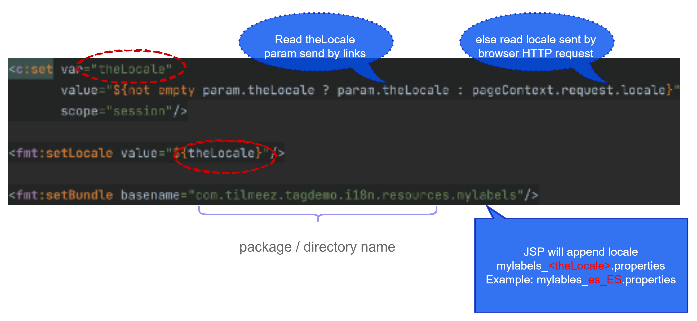

## JSP Tags Overview

There are two categories of JSP tags.  

**JSP Custom Tags** : Where we can write your own code and implement that code and use it as a tag .

**JSP Standard Tag Library (JSTL)** : Created by Oracle, common set of tags that can be used in JSP environment.

**Problem**
+ Email from: The Boss

  

**Option 1 : Use Scriptlets**
```JSP
<%
  // connect to remote weather service

  // submit our weather request

  // receive weather results

  // parse the data: xml or json ?? 

  // display outout in JSP page
%>
```

> **Bad Practice**
>> + Mix business code with presentation code
>> + Not reusable

**Option 2: JSP Custom Tags**
+ Move heavy business logic into supporting class
+ Insert JSP custom tag to use supporting class


As an example we can drop custom tag called weather report and add real heavy lifting is implement by a supporting by back-end java class   


**Benefits of JSP Custom Tags**
+ Minimize the amount of scriptlet code in a JSP
+ Avoids dumping thousands of line of code in a JSP
+ JSP page is simple ... main foucs of JSP in only the presentation
+ Tag is reusable

**JSP Standard Tad Library (JSTL)**

Oracle created a Specification for standard tags
+ Core
+ Messages Formating L18N
+ Functions
+ XML
+ SQL

_Core:_ For handling variables and looping and conditionals.
_Messages Formating L18N:_ For handling internationalization and formating.
_Functions:_ For doing string manipulation, getting the sizes of a collection.
_XML:_ For parsing and setting XML data.
_SQL:_ For accessing a database.

> SQL tags in general are considered bad practice.
> > Are good for prototyping, but not for real-world production applications.
> >


### JSTL Core Tags

| Tag       | Description                                                                            |
| --------- | -------------------------------------------------------------------------------------- |
| catch     | catches any throwable to occurs in the body                                            |
| choose    | Conditional tag that can be used for exclusive operations, similar to switch statement |
| if        | simple if/then conditional                                                             |
| import    | retrieves a URL and exposes its contents on the page or a variable                     |
| forEach   | Iterates over a collection of values                                                   |
| forTokens | Iterates over a collection of tokens                                                   |
| out       | Used in scriptlets to display output, similar to <%= ... %>                            |
| otherwise | Used with the `<choose>` tag to handle the else clause                                 |
| param     | Adds a parameter to a URL                                                              |
| redirect  | Redirects the browser to a new URL                                                     |
| remove    | Removes a scoped variable                                                              |
| set       | Assigns an expression value to a variable                                              |
| url       | Defines a URL with query parameters                                                    |
| when      | Used with the `<choose>` tag when a condition is true                                  |


**JSP Core Taglib Reference**
+ Every page that uses the Core tags must include this reference:
  

It's simply a unique identifier that associates your tag in the jar file.

#### foreach Tag

**Example: Looping with `forEach` Tag**   

+ At the top we have sample data, this is a part of a scriptlet
> Use JSTL to minimize scriptlets here just to load some sample data.
> > In the real world this will be provided by MVC system.

+ `cites` are set up as an attribute, whenever use of JSTL tags, they have to be a part of an attribute as on of the scope either `request`, `session` or `application`.
    + Here `pageContext.setAttribute(name , value)` reference to the object value is String[] cities.

  


**Example with forEach - Build HTML Tables**

  


```JSP
<%@taglib prefix="c" uri="http://java.sun.com/jsp/jstl/core" %>

<%@ page import="java.util.*, com.tilmeez.tagdemo.Student" %>

<%
    // just create some sample ta ... normally provided by MVC
    List<Student> data = new ArrayList<>();

    data.add(new Student("John", "Doe", false));
    data.add(new Student("Maxwell", "Johson", false));
    data.add(new Student("Mary", "Public", true));

    pageContext.setAttribute("myStudent", data);
%>
<html>
<body>
    <table border="1">

        <tr>
            <th>First Name</th>
            <th>Last Name</th>
            <th>Gold Customer</th>
        </tr>

        <c:forEach var="tempStudent" items="${myStudent}">
            <tr>
                <td>${tempStudent.firstName}</td>
                <td>${tempStudent.lastName}</td>
                <td>${tempStudent.goldCustomer}</td>
            </tr>
        </c:forEach>

    </table>

</body>
</html>
```

**Question:**

Is it possible to read cookie without scriptlet but using JSTL code?

**Answer:**   
Yes. The standard syntax to access HTTP Cookie value in JSP is:

```JSP
${cookie.<cookie name>.value}
```

So if you want to print value of cookie named “foobar” on JSP page, you would use:

```JSP
${cookie.foobar.value}
```

You can also loop through all of the cookies using this

```JSP
<c:forEach items="${cookie}" var="currentCookie">  
    Cookie name as map entry key: ${currentCookie.key} <br/>
    Cookie object as map entry value: ${currentCookie.value} <br/>
    Name property of Cookie object: ${currentCookie.value.name} <br/>
    Value property of Cookie object: ${currentCookie.value.value} <br/>
</c:forEach>
```


#### if tag

**Conditional Tests**

The `<c:if>` tag evaluates an expression and displays its body content only if the expression evaluates to true.

**Code Example**
* Display **Special Discount** if student is a gold customer  
  
```JSP
<%@taglib prefix="c" uri="http://java.sun.com/jsp/jstl/core" %>

<%@ page import="java.util.*, com.tilmeez.tagdemo.Student" %>

<%
    // just create some sample ta ... normally provided by MVC
    List<Student> data = new ArrayList<>();

    data.add(new Student("John", "Doe", false));
    data.add(new Student("Maxwell", "Johson", false));
    data.add(new Student("Mary", "Public", true));

    pageContext.setAttribute("myStudent", data);
%>
<html>
<body>
    <table border="1">

        <tr>
            <th>First Name</th>
            <th>Last Name</th>
            <th>Gold Customer</th>
        </tr>

        <c:forEach var="tempStudent" items="${myStudent}">
            <tr>
                <td>${tempStudent.firstName}</td>
                <td>${tempStudent.lastName}</td>
                <td>
                        <c:if test="${tempStudent.goldCustomer}">
                            Special Discount
                        </c:if>

                        <c:if test="${not tempStudent.goldCustomer}">
                            -
                        </c:if>
                </td>
            </tr>
        </c:forEach>

    </table>

</body>
</html>
```


#### Choose tag

**Conditional Tests**

The `<c:choose>`tag is similar to a switch statement.

**Code Example**  


 ```JSP 
<%@taglib prefix="c" uri="http://java.sun.com/jsp/jstl/core" %>

<%@ page import="java.util.*, com.tilmeez.tagdemo.Student" %>

<%
    // just create some sample ta ... normally provided by MVC
    List<Student> data = new ArrayList<>();

    data.add(new Student("John", "Doe", false));
    data.add(new Student("Maxwell", "Johson", false));
    data.add(new Student("Mary", "Public", true));

    pageContext.setAttribute("myStudent", data);
%>
<html>
<body>
    <table border="1">

        <tr>
            <th>First Name</th>
            <th>Last Name</th>
            <th>Gold Customer</th>
        </tr>

        <c:forEach var="tempStudent" items="${myStudent}">
            <tr>
                <td>${tempStudent.firstName}</td>
                <td>${tempStudent.lastName}</td>
                <td>
                    <c:choose>

                    <c:when test="${tempStudent.goldCustomer}">
                        Special Discount
                    </c:when>

                    <c:otherwise>
                        no soup for you!
                    </c:otherwise>

                    </c:choose>
                </td>
            </tr>
        </c:forEach>

    </table>

</body>
</html>
```


## JSP Standard Tag Library(JSTL)-Function Tags


**JSTL Functions - Prefix "fn"**

+ **Collection Length**
  + Length
+ **String manipulation**
  + toUpperCase, toLowerCase
  + substring, substringAfter, substringBefore
  + trim, replace, indexOf, startsWith, endsWith
  + contains, containsIgnoreCase, split, join ,excapeXml

**JSTL Functions Reference**
+ Every page uses the Function tags must include this reference:


**Code Example**

```JSP
<%@taglib prefix="fn" uri="http://java.sun.com/jsp/jstl/functions" %>
<%@taglib prefix="c" uri="http://java.sun.com/jsp/jstl/core" %>
<%@ page contentType="text/html;charset=UTF-8" language="java" %>

<html>

<body>

<c:set var="data" value="tilmeez" />

Length of the string <b>${data}</b>: ${fn:length(data)}

<br/><br/>

Uppercase version of the string <b>${data}</b>: ${fn:toUpperCase(data)}

<br/><br/>

Does the string <b> start with </b> <b>t</b>?: ${fn:startsWith(data, "t")}
</body>

</html>
```


   


**JSTL Split Function**

The `fn:split()` function splits a String into an array of substrings based on delimiter.

```JSP
  String[] split(String data, String delimiter)
```

**Code Example**   


**JSTL Join Function**

The `fn:join()` function concatenates a String array into single String based on a delimiter.

```JSP
  String join(String[] data, String delimiter)
```

**Code Example**  


```JSP 
<%@taglib prefix="c" uri="http://java.sun.com/jsp/jstl/core" %>
<%@taglib prefix="fn" uri="http://java.sun.com/jsp/jstl/functions" %>
<%@ page contentType="text/html;charset=UTF-8" language="java" %>
<html>
<body>

<c:set var="data" value="Singapore, Karachi, London, Dusseldorf"/>

<h3>Split Demo</h3>

<c:set var="citiesArray" value="${fn:split(data, ',')}"/>

<c:forEach var="tempCity" items="${citiesArray}">
    ${tempCity} <br/>
</c:forEach>

<h3>Join Demo</h3>

<c:set var="fun" value="${fn:join(citiesArray, '*')}"/>

Result of joining: ${fun}
</body>
</html>
```


# Build a Multi-Lingual App with JSTL - I18N tags

## Multi-Lingual/Internationalization Overview

**What is I18N?**
+ The term _Internationalization_ is frequently abbreviated as _I18N_
  + There are l8 letters betwwen the first "i" and the last "n" .

**Formatting Messages**
+ Instead of hard-coding display text/messages in your application
+ Make use of labels / the placeholders will use message of current locale
+ Locale = language + region
  + en_US = English (US)
  + en_GB = English (UK)
  + ...others...


+ You need to create translated versions of each label (no magic here)
+ Based on user's language selection, system will include appropriate text

**Formatting Dates, Number and Currency**

| **Locale**     | **Short Date** | **Long Date**     | **Number** | **Currency** |
| -------------- | -------------- | ----------------- | ---------- | ------------ |
| English, US    | 05/06/02       | May 6,2002        | 1,234.56   | $ 1,234.56   |
| English, UK    | 06/05/02       | 06 May 2002       | 1.234,56   | £ 1.234,56   |
| French, France | 06/05/02       | 6 mai 2022        | 1 234,6    | 1 234,56 €   |
| Japanese       | 02/05/06       | 2002 年 5 月 6 日 | 1,234.56   | ¥ 1,234.56   |

**JSTL Functions**

<html>
<head>
<style>
table {
    border-collapse: collapse;
}

table, td, th {
border: 1px solid black;
}
</style>
</head>
<body>

	<table>
		<tr>
			<th>Area</th>
			<th>Function</th>
			<th>Tags</th>
			<th>Prefix</th>
		</tr>
		<tr>
			<td rowspan="3" >I18N</td>
			<td>Setting Locale</td>
			<td>SetLocale <br/>request Encoding</td>
      <td rowspan="3">fmt</td>
		</tr>
		<tr>
			<td>Messaging</td>
			<td>bundle<br/>message<br/>param<br/>set bundle</td>
		</tr>
    <tr>
      <td>Number and Date <br/>Formatting</td>
     <td>formatNumber<br/>
       formatDate<br/>
       parseDate<br/>
       parseNumber<br/>
       setTimeZone<br/>
       timeZone </td>
	</table>

</body>
</html>

**Multi-Lingual Application**


**Formatting Messages**


**What is a Locale?**  
`Locale = Language Code + Country Code`
+ There are difference for a language depending on the country
+ For example
  + English (US)
  + English (GB)


**To Do List**

+ Step 1 : Create Resource Files
  + Translated version of your labels
+ Step 2: Create JSP Page with labels
+ Step 3: Update JSP page to change locale based on user selection

**Step 1: Create Resource Files**
+ Translated versions of your labels
  + You will need to use Google Translator or similar translator
+ Must name the file using the locale
+ File name must follow specific formate 
  + **`<your project file name>_LANGAUGECODECOUNTRYCODE.properties`**
+ Example
  + mylables_es_ES.properties
  + mylables_de_DE.properties
  + mylables_en_GN.properties
+ Language Codes based on ISO Standard 639-1 (2 letter code)
  + https://en.wikipedia.org/wike/ISO_639-1
+ Country Codes based on ISO Standard 3166-2 (2 letter code)
  + https://en.wikipedia.org/wike/ISO_3166-2
+ Here's an example for the locale: **German - Germany**

**File: mylabels_de_DE.properties**
```Properties
label.greeting=Hallo
label.firstname=Vorname
label.lastname=Nachname
label.welcome=Willkomen in der Ausbildung Klasse.
```

**Step 2: Create JSP page with labels**

**File:i18n-messages-test.jsp**


**Step 3: Update JSP page to change locale based on user selection**
+ Our JSP page will send links to itself
+ Will pass the locale as a parameter
+ 


```JSP
<a href="i18n-messages-test.jsp?theLocale=en_US">English (US)</a>
|
<a href="i18n-messages-test.jsp?theLocale=es_ES">Spanish (ES)</a>
|
<a href="i18n-messages-test.jsp?theLocale=de_DE">German (DE)</a>
```

